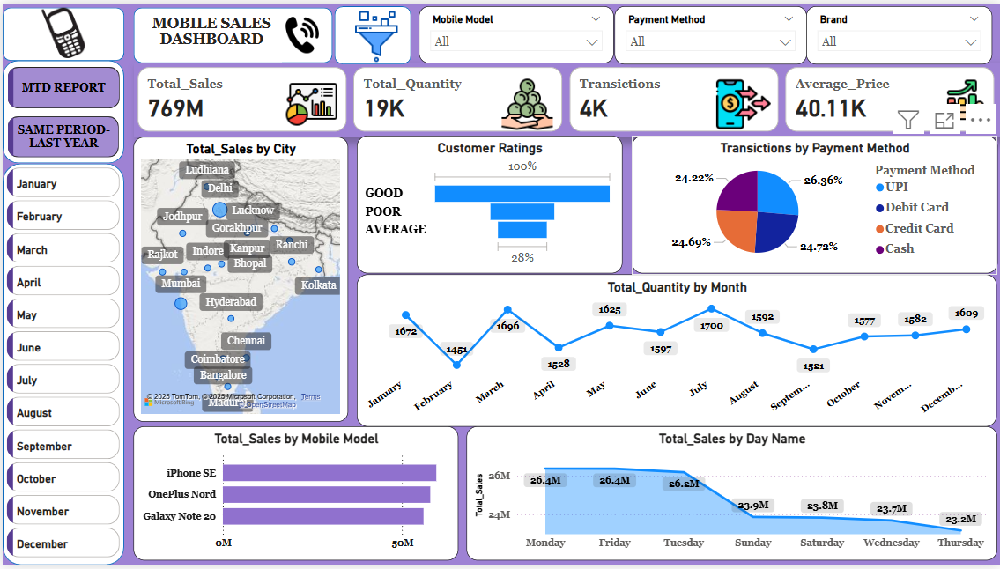
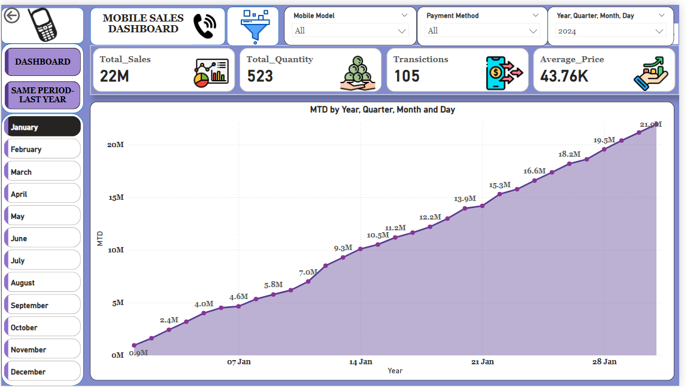
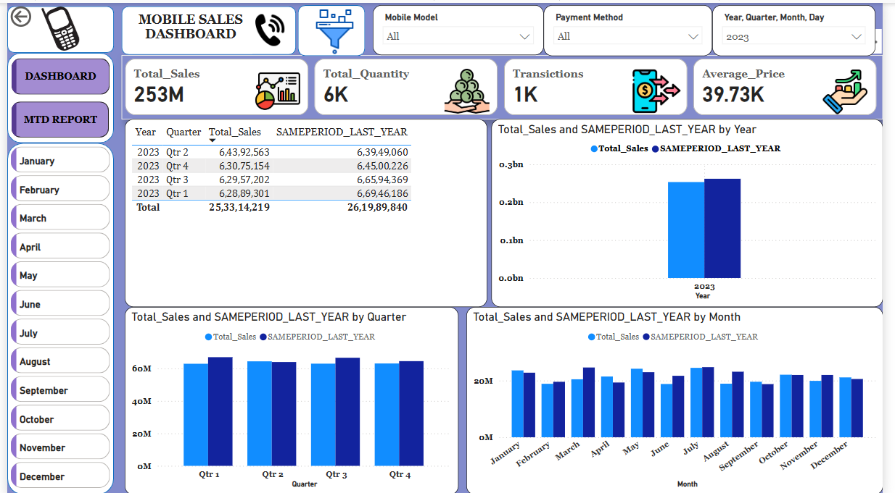

# Mobile Sales Dashboard - Power BI Project

## 📌 Project Overview
This Power BI project provides a comprehensive analysis of mobile sales data, including total sales, quantity sold, transactions, and pricing trends. The dashboard presents insights through interactive visuals, enabling better decision-making based on key performance indicators.

## 🛠️ Tools & Technologies Used
- **Power BI** (for data visualization and dashboard creation)
- **Excel and Power_Query** (for data cleaning and preparation)

## 📊 Key Features
### **1. Main Dashboard**
- Displays **Total Sales, Total Quantity, Transactions, and Average Price**.
- Yearly, quarterly, and monthly sales comparison with the **SAMEPERIOD_LAST_YEAR** metric.
- Sales breakdown by different time periods using bar and line charts.

### **2. Month-to-Date (MTD) Report**
- Sales and quantity trends for the current month.
- Interactive buttons to filter by different months.
- Comparison with the previous year's same period.

### **3. Map - Visualization**
- Geographic analysis of sales across different cities in India using a **map visualization**.
- Sales contribution of different regions.

### **4. Sales by Mobile Model & Payment Method**
- Breakdown of sales by different mobile models.
- Insights into customer payment preferences using a **pie chart**.

### **5. Customer Ratings & Buying Trends**
- Visual representation of customer ratings: **Good, Average, and Poor**.
- Daily and monthly purchase trends to analyze peak sales days.

## 📂 Dataset
<a>Mobile Sales Dataset</a>
The dataset contains mobile sales records, including:
- **Date** (Year, Quarter, Month, Day)
- **Total Sales & Quantity**
- **Transactions Count**
- **Mobile Model**
- **Payment Method**
- **City & Region**
- **Customer Ratings**

## 📸 Dashboard Previews
### **Main Dashboard**

### **MTD REPORT**

### **SAME PERIOD LAST YEAR**

## 🔎 Insights & Findings
- **Quarterly Sales Trends:** Sales are fairly stable across quarters but show minor fluctuations.
- **Popular Payment Methods:** UPI and Debit Cards contribute to the highest percentage of transactions.
- **Best-Selling Mobile Models:** The **iPhone SE, OnePlus Nord, and Galaxy Note 20** have the highest sales.
- **City-Wise Sales:** Major sales contributions come from metro cities like Mumbai, Bangalore, and Delhi.
- **Customer Ratings:** A significant portion of customers rated their purchases as **Good**, indicating high satisfaction.

🔗 **Connect with Me:** [https://www.linkedin.com/in/likith-kanumuri-5b0529287/]

📌 If you find this project useful, don't forget to ⭐ star the repository!

